# Tema 1: Introducción

## Performance engineering
**Definición**: El estudio del rendimiento de los sistemas de computación y comunicaciones a fin de comprender y predecir su comportamiento en función del tiempo, mediante un enfoque sistemático y cuantitativo.
- Enfoques: Reactivo(Fix-it-later); Proactivo(PE/SPE).

**Tenemos 4 elementos clave**: El tiempo, la evaluación del rendimiento, las métricas y las pruebas.

### Definiciones

**Sistema**: Conjunto de componentes software, hardware y firmware.

**Rendimiento**: Tenemos dos.
- Comportamiento del sistema en relación al tiempo.
- Grado de cumplimiento de los objetivos de tiempo de respuesta y la eficiencia con la que consigues alcanzarlos.

**Especificaciones del rendimiento**: Documento que establece las características del rendimiento que un sistema o componente debe exhibir.

**Evaluación del rendimiento**: Conjunto de actividades que forman parte del estudio del comportamiento de un sistema.

**Pruebas del rendimiento**: Conjunto de pruebas destinadas a evaluar el ajuste del sistema o componente a los requisitos de rendimiento especificados.

### Rendimiento
- De sistemas:
    - Validación en entornos de computación.
    - Capacidades de un cierto hardware bajo una cierta carga dada por el sistema software.
    - El software:
        - Se considera un parámetro numérico complejo de un modelo de rendimiento.
        - Comportamiento estocástico del software se sintetiza en una cierta carga de trabajo.
        - No hay modelo explícito de la estructura y lógica del software.
    - Acciones de ajuste y mejora: Sobre hardware y distribución de carga.
- De software: 
    - Complejidad del software. Modelado explícito de la estructura y la lógica.
    - Soluciones de rendimiento al margen del rendimiento del sistema. Búsqueda de alternativas (arquitectura, diseño, implementación) que aprovechen mejor la plataforma subyacente.
    - Primera opción en la búsqueda de soluciones a los problemas de rendimiento. Menos caro y mejora en la complejidad del software.
- Evaluación:
    - **Cuantificación del servicio** proporcionado por un sistema de computación o comunicaciones.
    - Componentes: Rendimiennto de los elementos constituyentes del sistema.
    - Sistema: Rendimiento del sistema, a partir de los comportamientos de los componentes.
    - Atributos que caracterizan el rendimiento: Carga de trabajo, respuesta, tasa de errores, productividad, capacidad, utilización, ...
*****
### Evaluación del rendimiento
#### TÉCNICAS
**Medición**: Observación de la operación del sistema durante un periodo de tiempo.

**Simulación**: Construcción de un programa de ordenador para simular el comportamiento del sistema que se está modelando.

**Modelado analítico**: Construcción de un modelo matemático del sistema observado.
#### OBJETIVOS
**Predicción del rendimiento**: Estimación del rendimiento de un sistema para un escenario concreto de carga de trabajo y configuración de sistema.

**Ajuste del rendimiento(tuning)**: Análisis del efecto de diferentes configuraciones y valores de los parámetros del sistema en su rendimiento.

**Dimensionamiento y planificación de la capacidad**: Determinación de la configuración necesaria de sistema para garantizar unos niveles de rendimiento.

**Monitorización y análisis de un sistema informáctico**: Se realiza durante la vida útil de un sistema en ejecución. Performance bottlenecks.

#### CARGA DE TRABAJO (WORKLOAD)
Conjunto de peticiones de servicio a un sistema durante un intervalo de tiempo.

Características:
- Elevado número de elementos.
- Variación a lo largo del tiempo (PATRONES DE COMPORTAMIENTO TEMPORAL).
- Interacción con el sistema que la procesa.

Rendimiento: Intensidad de la carga y características de la demanda.

Modelo de carga: Captura el comportamiento estático y dinámico de la carga real. Compacto, repetible y preciso. 

#### MÉTRICA DE RENDIMIENTO 
**Métrica**: Magnitud medible que captura de forma precisa aquello que queremos medir.

**Métrica de rendimiento**: Métrica que permite describir el rendimiento de un sistema.

**Condicionantes**:
- La definición de la métrica depende del sistema a medir.
- Depende de las condiciones experimentales bajo las que se obtiene (carga).
- Depende del método de muestreo elegido para obtener los valores.

**Métricas unidimensionales**: Expresadas con un valor (P.ej:Consumo de potencia). Comparación de valores = Orden total.

Dentro de este tipo de métricas tenemos dos grupos:
- HB: El valor más alto es el mejor (P.ej: peticiones/segundo).
- LB: El valor más bajo es el mejor (P.ej: tiempo de respuesta).

**Métricas multidimensionales**: Expresadas por un vector de valores.Comparación de valores = Orden parcial.

En el contexto que nos vamos a mover, nuestro trabajo va a estar situado en los sistemas software ya existentes y sistemas software planificados (los futuros sistemas que están por venir, que también se deben tener en cuenta).
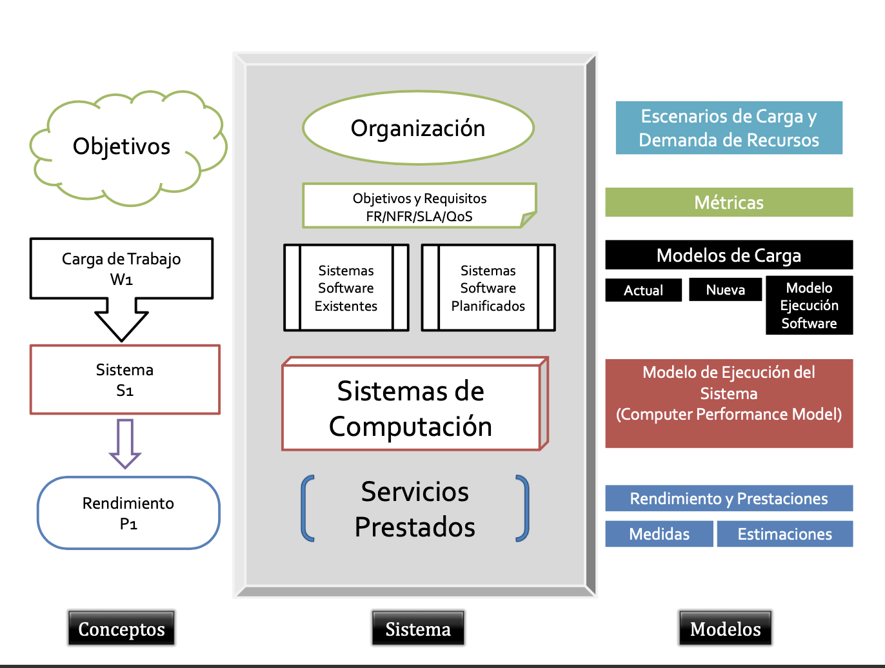

Los usuarios generarán una carga de trabajo (W) en el Sistema de computación, y esto generará un rendimiento (P), que se evaluará en función de los objetivos y requisitos (FR, NFR, SLA, QoS).
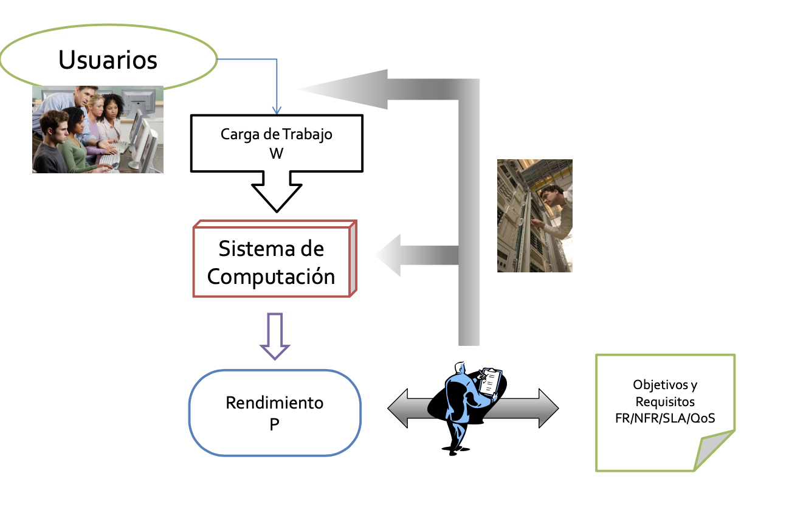

Las herramientas con las que vamos a contar son:
- Carga Real (Actual): W.
- Modelo de Ejecución de Software.

contra...

- Sistema de computación.

genera...

- Rendimiento: P.

se compara con...

- Requisitos: FR, NFR, SLA, QoS.

Para realizar una comparación entre varios sistemas, deberemos tener una carga de trabajo W para los n sistemas que vamos a evaluar, y estos generarán un rendimiento Pi, que será lo que comparemos.
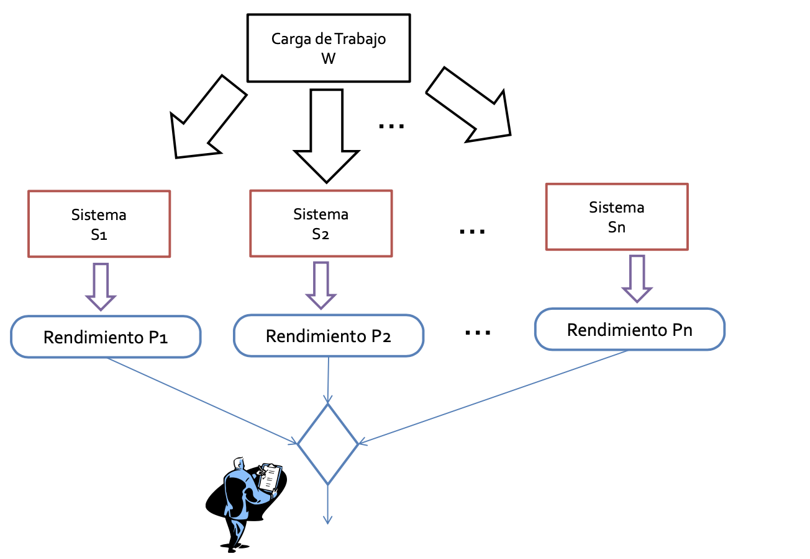

## Técnicas de medida en la evaluación del rendimiento

### Principios de medida
ENFOQUE EXPERIMENTAL EN EL ESTUDIO Y EVALUACIÓN DE PROCESOS Y SISTEMAS EN CIENCIA E INGENIERÍA.

**Medida**: Permite tratar los fenómenos de naturaleza compleja de forma cuantitativa.

**Medir un sistema de computación**: Recoger información de la actividad del sistema mientras da servicio a los usuarios (reales o simulados).
- Se puede medir mediante traza, la cuál afecta directamente al desempeño del sistema.
- Se puede medir mediante muestreo, esto es, recoger datos cada cierto intervalo de tiempo. NO afecta al rendimiento.

**Características básicas a medir**:
- El número de veces que sucede un evento.
- La duración de algún intervalo de tiempo.
- El tamaño de algún parámetro.

### Medida del rendimiento

El rendimiento de un sistema se realiza mediante **medidas cuantitativas**.

Debemos elegir un métrica, que depende de los objetivos del estudio y del coste de recogida de información.

Las consideraciones que debemos tener en cuenta para esto son:
- Qué, cómo y con qué medir.
- Presentación y resument de los datos.
- Errores de medida.
- Experimentos de medida: 
    - Determinación de la carga de trabajo a procesar en la recogida de datos.
- Método de muestreo: Para medidas realizadas en diferentes intervalos de tiempo se debe realizar una normalización de las mismas (para posteriormente poder comparar).

### Métricas de rendimiento
Tenemos dos puntos de vista:
- Visión externa - Métricas externas del rendimiento: Desde el punto de vista del usuario. Son medidas de satisfacción percibida por el usuario (tiempo de respuesta, probabilidad de rechazo del servicio, etc...).
- Visión interna - Métricas internas del rendimiento: Desde el punto de vista del administrador del sistema. Son medidas del comportamiento del sistema en su conjunto (productividad, utilización, demanda, disponibilidad, etc...).

#### **Términos**
**Métrica de rendimiento**: Característica medible del rendimiento
**Índice de rendimiento**: Descriptor usado para describir o representar el rendimiento (medias, medianas, percentiles, ....).

### Métricas habituales

#### **Tiempo de ejecución**
Tiempo necesario para ejecutar un determinado programa de aplicación. **ES UNA MEDIDA LB**.

Este tipo de métrica no es determinista, pues está influenciado por las condiciones del sistema. Debemos proporcionar, al menos, la media y la varianza.

#### **Tiempo de respuesta**
Medida del período de tiempo que un usuario o aplicación han de esperar desde el momento de enviar una acción o comando hasta la finalización y retorno de control del comando solicitado.
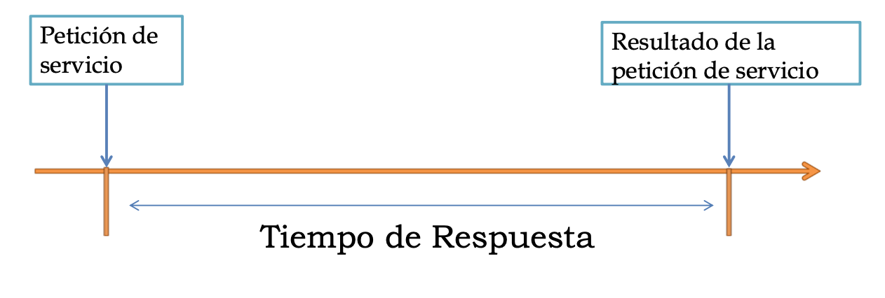

> **Consideraciones**:
>
> Ni las peticiones ni las respuestas son instantáneas. En esto entran en juego tiempos tales cómo el de pensar, el de reacción, de procesamiento, ...
>
> Deberemos calcular el tiempo de respuesta medio:
>
> Para un periodo de observación [0,T] y para un número de observaciones de tiempos de respuesta individuales observados en el período N(T)>= 1
>
> 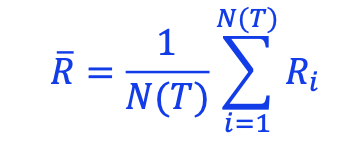
>
> Debemos tener en cuenta que el tiempo de respuesta es variable y que depende fuertemente de la carga, del tipo de servicio solicitado y de las condiciones del sistema.
>
> Su incremento es directamente proporcional al incremento de la carga.
>
> **Si la variabilidad del tiempo de respuesta es baja, el sistema es predecible.**

Tenemos el tiempo de respuesta en distintos ámbitos.
- Sistemas interactivos: El tiempo se puede desglosar en varios distintos tiempos de respuesta, siendo todos válidos en función del contexto.
    - **Tiempo de pensar**: Tiempo que transcurre desde que el sistema está disponible para que el usuario realice otra petición hasta que la realiza (afecta al rendimiento).
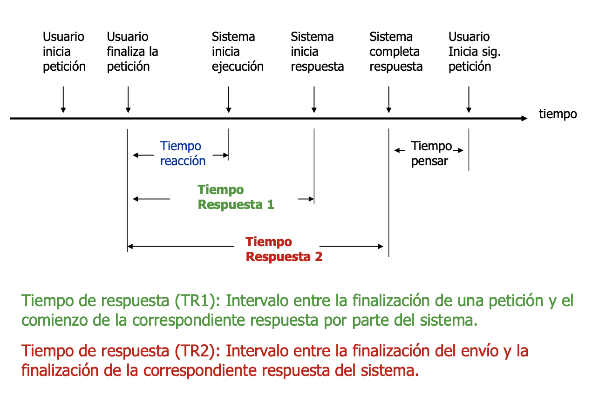
- Sistemas transaccionales (Base de datos):
    1. Introducción de la transacción.
    2. Sistema de BD configura las estructuras de datos y proporciona los recursos necesarios para la ejecución de la transacción.
    3. Motor de BD ejecuta la transacción.
    4. Se completa la transacción, se preparan los resultados de la transacción y se envían.
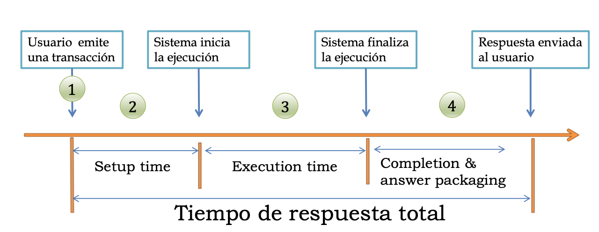
- Sistemas web:
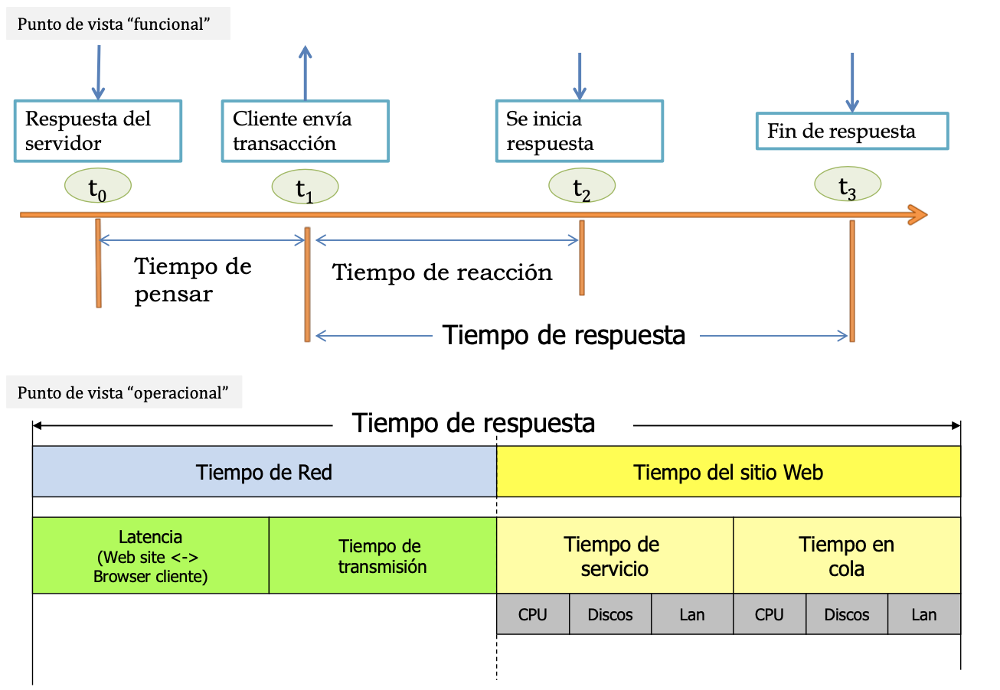

#### **Productividad (Throughput)**
**Cantidad de trabajo útil** ejecutado por unidad de tiempo en un entorno de carga determinado. Proporciona un índice de velocidad de ejecución para el conjunto de Np programas.
> Se mide en operaciones por unidad de tiempo.
>
>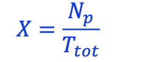
>
>Donde:
>- Ttot es el invervalo de medida.
>- Np es el nº de peticiones procesadas en el intervalo de medida.

#### **Utilización**
Fracción de tiempo que el recurso está ocupado sirviendo peticiones. Medida de **tipo NB**(Valor nominal el mejor). **Ratio del tiempo ocupado frente al tiempo de medida**.

ESTA MEDIDA ES ABSOLUTA, NUNCA PUEDE SER MAYOR DE 1 SI ESTAMOS EN TANTO POR 1, NI MAYOR DE 100 SI ESTAMOS EN %. **TENER EN CUENTA ESTO A LA HORA DE RESOLVER PROBLEMAS, PUES SI DA MEDIDAS QUE SUPERAN ESE LÍMITE, HAY QUE REVISAR EL EJERCICIO**

#### **Otras**
**Capacidad**. Medida HB
- Nominal(teórico): Throughput máximo alcanzable bajo condiciones de carga ideales.
- Utilizable(real): Throughput máximo alcanzable sin exceder un tiempo de respuesta especificado.

**Eficiencia**. Medida HB

**Potencia**. Medida HB

**Disponibilidad**. Medida HB

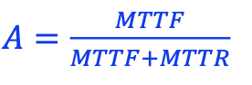

<!--Salto de página-->

### Selección de métricas de rendimiento
Las métricas se definen para cada estudio, y en función de las características, se seleccionan unas métricas u otras.
- Se tienen en cuenta criterios de rendimiento o comportamiento.
- **Las métricas elegidas deben permitir obtener conclusiones válidas**.
    - Cuidado con el síndrome del martillo: "*Una vez que se sabe manejar un martillo, se tiende a usarlo con todo*". También se cae en el error de cuándo se cuenta con una solución, acoplar el problema que se tiene para que encaje con esa solución.
- **Selección en base a los servicios ofertados por el sistema**.
    - Caracterización de la calidad del servicio.
    - Respuesta proporcionada a las solicitudes de servicio.
- **Selección en base al conjunto habitual de métricas**.
    - Están relacionadas con el consumo de tiempos, la utilización de recursos o dispositivos y el trabajo realizado por el sistema o los componentes del mismo.
    - Se debe adaptar su definición e interpretaciónn a las características del sistema y del problema en estudio.
#### **Servicios del sistema**
Para cada petición de servicio al sistema, tenemos 3 tipos de respuestas posibles:
- Realización correcta del servicio [Métricas de velocidad]: Grado de reacción, productividad, utilización.
- Realización incorrecta del sevicio [Métricas de fiabilidad]: Errores, sus tipos y probabilidad.
- Rechazo del servicio [Métricas de disponibilidad]: Clasificación de los fallos y sus probabilidades.

Para valorar estas métricas se tiene en cuenta: El valor medio y la Variabilidad (*Varianza, sesgo, percentiles...*).
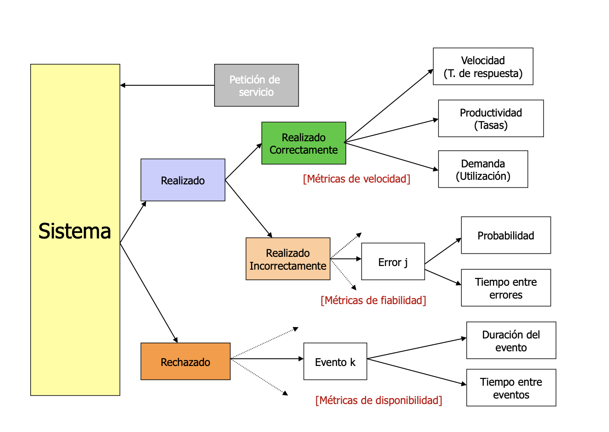

Viendo este esquema entramos en el tema de las probabilidades. Para una petición, tenemos 2 opciones, que se realice o que se rechace (probabilidad de una u otra opción), y así sucesivamente.
- Métricas de velocidad:
    - Velocidad (Tiempo de respuesta).
    - Productividad (Tasas).
    - Demanda (Utilización).
- Métricas de fiabilidad:
    - Probabilidad.
    - Tiempo entre errores.
- Métricas de disponibilidad:
    - Duración del evento.
    - Tiempo entre eventos.
- **Métricas de imparcialidad**: Que se trate a todos los clientes con equidad.

#### Ejemplo del *Jain, página 35*:
> Nuestro problema es la comparación de dos algoritmos diferentes de control de la congestión para redes de ordenadores.
> Los resultados posibles para el algoritmo son los siguientes:
> - Algunos paquetes se entregan en orden al destino correcto.
> - Algunos paquetes se entregan desordenados al destino.
> - Algunos paquetes se entregan más de una vez al destino (paquetes duplicados).
> - Algunos paquetes se pierden por el camino.
>
> **Métricas de fiabilidad**:
> - Probabilidad de llegadas desordenadas.
> - Probabilidad de paquetes duplicados.
> - Probabilidad de paquetes perdidos.
>
> **Métrica de disponibilidad**: Probabilidad de desconexión.
>
> **Métrica de imparcialidad**: La red es un sistema multiusuario. Es necesario tratar por igual a todos los usuarios.
>
> **Métrica - Tiempo de respuesta**: Retraso dentro de la red para los paquetes individuales y varianza del tiempo de respuesta.
>
> **Métrica - Productividad(Throughput)**: Nº de paquetes por unidad de tiempo.
>
> **Métricas de demanda**:
> - Tiempo de procesador por paquete en el sistema final fuente.
> - Tiempo de procesador por paquete en el sistema final destino.
> - Tiempo de procesador por paquete en el sistema intermedio.

#### **Resumen e interpretación de los datos de rendimiento**
Deberemos realizar un análisis descriptivo para caracterizar el fenómeno de estudio. En el contexto de la asignatura no vamos a realizar inferencia de datos. Para ello, deberemos:
- Obtener las características de cada variable - métrica de rendimiento: Nº de observaciones, rangos y valores para cada variable.
- Caracterizar el conjuntos de datos y las relaciones existentes entre las variables.
- Debemos tener en cuenta que **son datos muestrales** que incorporan aleatoriedad: Deberemos determinar la *incertidumbre* de la estimación del rendimiento.

**Técnicas de análisis exploratorio de datos**: Reducción de datos y técnicas de presentación.

**Resultados**:
- Índices de tendencia central: Media(s) y mediana.
- Índices de dispersión: Desviación estándar, CoV, IQR.
- Distribución (es muy difícil que tengamos una normal).
- Índices de imparcialidad.

#### **Índices de tendencia central**
**Media aritmética**: Se usa con datos no sesgados. La totalización de los datos de las observaciones es de interés para el estudio.

**Media ponderada**: Si los componentes de la carga tienen diferente peso.

**Mediana**: Se usa para distribuciones sesgadas. La mediana reduce el efecto de sesgo que provocan los outliers en el valor de la media.

##### **Media ponderada**
Asignación de pesos wi dependendiendo de la mayor o menos importancia que se le quiera dar a cada medida. Se aplica la restricción:

**Tiempo de ejecución**: Los pesos se asignan en función de la frecuencia de uso de los diferentes programas, donde *Ti* es el tiempo de ejecución del programa *i*.
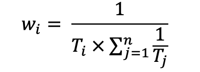

##### **Índices de rendimiento - Variabilidad**:
**Índices de dispersión**: Rango, desviación estándar, p-Cuantil(Cuartil/Percentil), IQR(Rango intercuartílico).

**Coeficiente de variación**: desviación estándar re-escalada por la media.
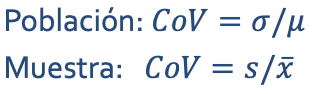.

**Mean Absolute Desviation (desviación absoluta promedio)**:
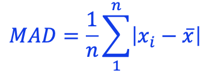.

- 0 <= MAD <= s - Menos sensible a valores grandes que la desviación estándar.
- Si xi proviene de distribuciones de cola larga, con media finita x:
    - s -> infinito y MAD converge a un límite finito.

**Histogramas**: Se usan para realizar una representación gráfica de la distribución empírica de los datos.

Para describir los datos, tenemos la **función de distribución empírica de la muestra(CFD)**:
Función en la que se asigna a cada valor la frecuencia relativa acumulada muestral y que aproxima la función de distribución poblacional cuándo aumenta el tamaño muestral.
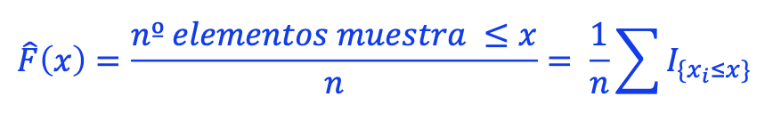

#### **Índices de rendimiento**
##### **Valores promedio**
Algunas consideraciones a tener en cuenta es que se suele tomar el valor promedio de la métrica de rendimiento como el índice de referencia del rendimiento del sistema, y esto puede dar lugar a una serie de problemas:
- El rendimiento de un sistema de computación es multidimensional. **Reducirlo a un número es, en el mejor de los casos, engañoso**.
- La comparación de medias solamente puede proporcionnar comparaciones de sistemas poco precisas.
- La media aritmética NO siempre es adecuada para promediar datos de rendimiento. **Las medidas de rendimiento son medidas directas del tiempo, o son tasas referenciadas a unidades de tiempo o razones**.
> Ejemplo: Se tiene un pollo. Si una persona se come el pollo entero y otra persona no come nada, el valor promedio es que cada persona a comido 1/2 pollo (para comparar puede servir, pero dista considerablemente de la realidad).
##### ***Tipos de medidas de rendimiento**
- Medidas directas: Tiempo de ejecución, tiempo de respuesta, etc...
- Tasas (Rate metrics): Relaciona el cambio de una magnitud por unnidad de cambio de la otra (MIPS, Transacciones por segundo, etc...).
- Razón (Ratio metrics): Relación entre dos o más elementos o cantidades similares que sirve para realizar comparación de métricas de rendimiento entre sistemas.
- Normalizadas: Métrica de razón entre el sistema en estudio y un sistema de referencia.

**Media aritmética**: Se usa para obtener una primera aproximación de los valores que vamos a comparar.

**Media armónica**: Se usa para elaborar un índice de rendimiento, ya que es un buen comparador para las productividades relativas. Los componentes que de la carga que más tiempo consumen son los que tienen mayor influencia en el valor resultante de la media.

**Media geométrica(Siempre se encuentra por debajo de la media aritmética)**: Se usa para medias de tasas de crecimiento/mejora (Se usa si el producto de las observaciones constituye un valor de interés), aunque no es adecuada ni para tiempos ni para ratios.

Es adecuada para números normalizados y apropiada para resumir las medidas con un rango amplio de valores, ya que los valores individuales tienen poca influencia en la media (si un rendimiento es muy distinto al resto, por ejemplo, más pequeño, el valor de la media baja).

VENTAJA: Mantiene el orden de los datos independientemente del sistema de referencia.

INCOVENIENTE: Ese orden puede no ser correcto.

**Índice de rendimiento SPEC - CPU**: Es un Benchmark2* estándar de medida rendimiento para una CPU. 

*Un Benchmark es un conjunto de pruebas de rendimiento estandarizadas que fijan un valor de referencia para el rendimiento de sistemas.

**Índice de equidad - Fairness Index**: Se considera cómo índice de calidad del rendimiento en esquemas de asignación de recursos.

Debemos iguales la productividad, los retrasos, los tiempos de respuesta...

Los valores de estas medidas se encuentran en el intervalo [0,1], dónde 0 es nada de equidad y 1 equidad total. 

Se debe tener en cuenta que **equidad no es igualdad**, y esto significa que no se debe por qué tener una distribución uniforme de recursos entre todos los clientes, ya que algunos pueden tener más prioridad que otros (se debe dar a cada uno lo que le corresponde).

Sabiendo esto, en lugar de usar valores absolutos, usaremos comparaciones entre los resultados obtenidos y los teóricos, para saber el índice de equidad con el que se cuenta.

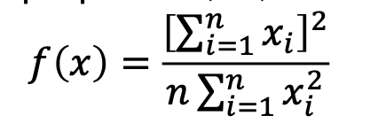

#### **Diagramas**
Los diagramas que vamos a usar van a ser los siguientes:
- Lineal (gráfico de líneas). Se usa para ver cómo evoluciona la información.

- Diagrama de dispersión (Scatterplot). Se usa para saber la relación entre las medidas (p.ej. rendimiento frente a carga).
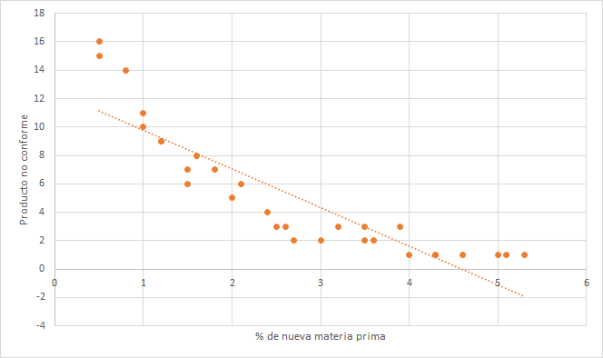

- Diagrama de cajas y bigotes (Boxplot). Se usa mucho en Evaluación del Rendimiento, ya que da una visión clara del comportamiento y la forma de los datos.
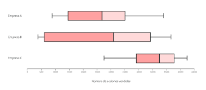

- Diagrama radial (Gráfico de estrella).
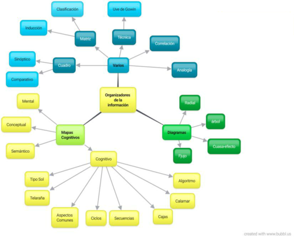

##### *Boxplot. Descripción de la distribución de los datos*
Los puntos destacados de estos diagramas son: Mediana (y su intervalo de confianza), cuartiles (25% y 75%), bigotes (distancia de 1'5 veces el rango intercuartílico) y posibles outliers.

##### *Diagramas radiales. Métricas multimensionales*
Estos diagramas se suelen usar mucho en evaluación de rendimiento para realizar comparaciones y dar una vista rápida del comportamiento del sistema. Los datos deben normalizarse sobre los ejes para poder representar la información correctamente.

###### **Diagramas radiales de Kiviat**: Se usan para comparar sistemas en base a la forma del diagrama.
- Se selecciona un número par de variables a estudiar, la mitad de ellas son métricas HB y la otra mitad LB.
- Se subdivide el círculo en tantos sectores como variables a representar.
- Su numerann los semiejes comenzando por el semieje vertical superior (preferiblemente en sentido horario).
- Se asocian los índices HB a los semiejes impares y los LB a los pares.
- Se escalan las métricas de forma que los máximos formen un círculo, y lo mismo con los mínimos.

###### **Diagramas de Kiviat versión de Kent**:
- X1: CPU ocupada o activa.
- X2: Sólo CPU ocupada.
- X3: Solapamiento de CPU y canal.
- X4: Sólo canal ocupado sin solape con la CPU. CPU en idle.
- X5: Cualquier canal ocupado.
- X6: CPU en espera. Está esperando a que se completen E/S.
- X7: CPU en estado usuario o atendiendo programas de usuario.
- X8: CPU en estado supervisor, ejecutando SO, es la sobrecarga del S.O.

Un sistema balanceado corresponde una situación ideal. Todas las métricas se encuentran entre el 0% y el 100%.
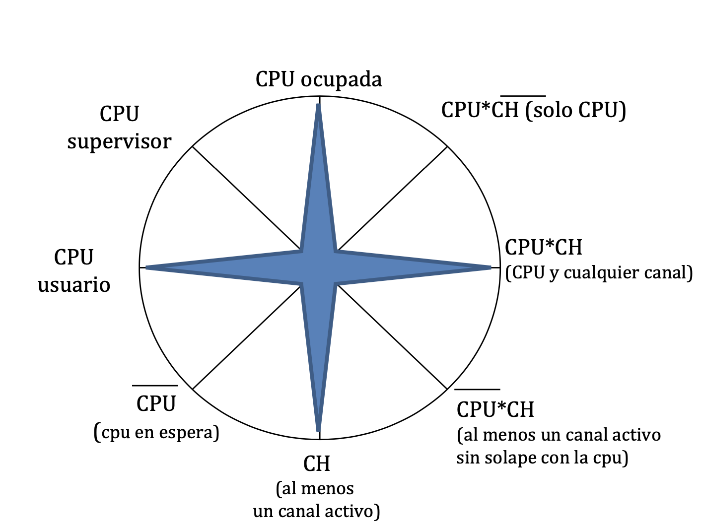

###### **Formas de gráficos de Kiviat. Versión Kent**

|  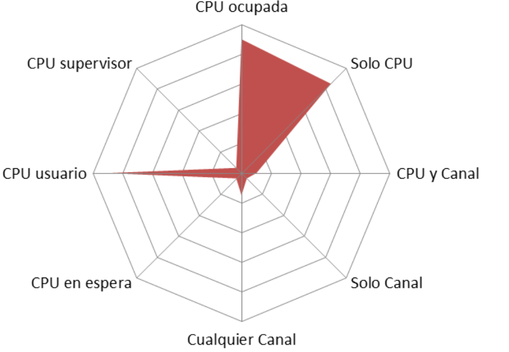 |  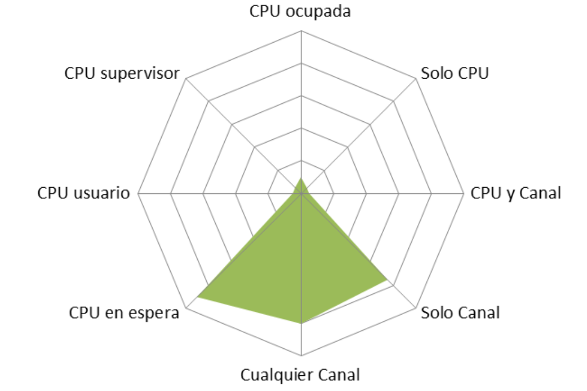 |
|-------------------------------|----------------------------------|
|  **Vela de barco**: Sistema limitado por la CPU. Mucha demanda de CPU y poca utilización de canales. |  **Cuña o iceberg**: Sistemas limitado por la E/S. Alta demanda de E/S, baja demanda de CPU.|
|  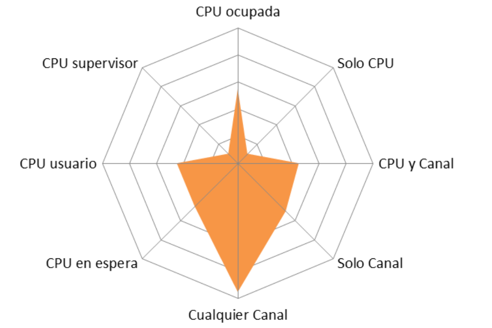 |  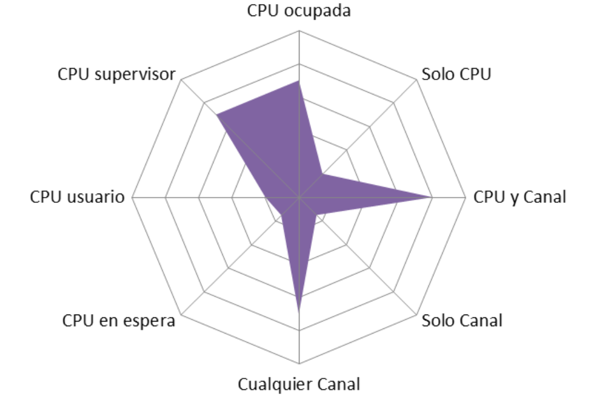 |
|  **Flecha de E/S**: Sistemas limitados por la E/S. | **Thrshing**: Sistema saturado por la paginación.  |
|||

###### **Figure Of Merit (FOM)**: Expresión númerica representando la eficiencia de un determinado sistema, material o procedimiento. Se usa cómo índice de comparación entre sistemas.

Sirve para calcular el área que ocupa la figura en el caso del gráfico de Kiviat y si las figuras son similares (NO CONSIDERA SI ESTÁ O NO BALANCEADO). 

Gráfico de Kiviat con 2n ejes:
- {x1, x2, ..., x2n}; 0 <= xi <= 100, para todo i = 1, ..., 2n.
- xi representa el porcentaje de los valores de rendimiento.
- Los valores impares de xi hasta x2n-1 son las métricas HB.
- Los valores pares de xi hasta x2n son las métricas LB.

La FOM compuesta por Merrill se calcula:
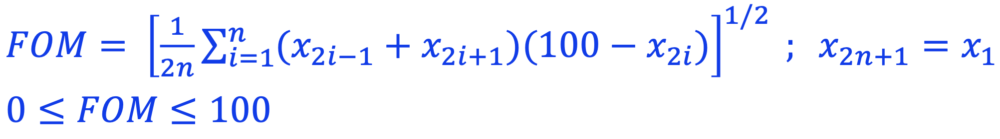

El sistema A será mejor que el B si FOMA > FOMB

Limitaciones del FOM:
- Se considera que todos los ejes tienen la misma importancia: Dependiendo del sistema, un 70% de utilización de CPU no tiene que ser igual de bueno que un 70% de E/S.
- Se asume que alcanzar los valores extremos es lo mejor: El valor máximo de una métrica no siempre es deseable (un 100% de CPU puede provocar tiempos de respuesta muy elevados).
- No es una función lineal: Un sistema con un FOM del 50% no es el doble de bueno que un sistema con una métrica del 25%.
- Dos sistemas con el mismo FOM no tienen que ser igual de buenos: En ciertas circunstacias un sistema con un FOM inferior puede ser preferible a uno con un FOM superior.

#### **Consideraciones para elaborar índices**:
- Los resultados obtenidos de las mediciones de rendimiento son datos muestrales. Cada media (mediana) es un estimador de la media (mediana) de la población.
- Índice de rendimiento: Media o Mediana de una serie de medidas de rendimiento.
- Debemos cuantificar la incertidumbre del índice de rendimiento motivada por la aleatoriedad de las medidas.

#### **Precisión**
Dispersión del conjunto de valores obtenidos de mediciones repetidas de una magnitud (variabilidad).

#### **Exactitud**
Cuán cerca del valor real se encuentra el valor medido (sesgo).

#### **Intervalos de confianza**
Cuantifican la incertidumbre debida a la aleatoriedad de las muestras en la estimación del parámetro.

Un intervalo de confianza estrecho indica una estimación del parámetro con un alto grado de precisión.

##### **Intervalo de confianza para la media**
- Observaciones en la muestra son independientes y están idénticamente distribuidas.
- Para n < 30 se requiere que provengan de una población con distribución normal.
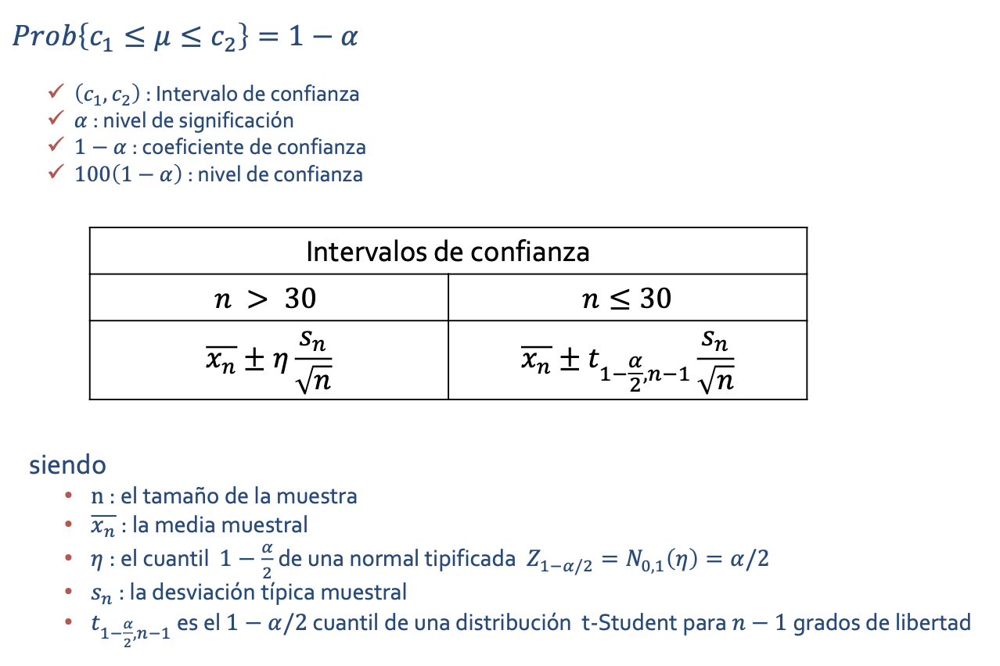

Comparación de alternativas. Para comparar 2 sistemas con cargas similares la comparación se realiza en base a los tiempos de ejecución (teniendo N programas o transacciones).
- Para observaciones emparejadas:
    - Correspondencia 1 a 1 entre el *i_esimo* test en el sistema A y el *i_esimo* test en el sistema B.
    - Se traba como si fuese una única muestra de N parejas.
- Procedimiento:
    - Para cada pareja se calcula la diferencia di de los tiempos de ejecución del *i_esimo* test en los sistemas A y B 
    - Se construye el intervalo de confianza (alpha = 0.1 o alpha = 0.05) para las diferencias di. Si el intervalo incluye el 0, entonces no son significativamente diferentes.

##### **Muestras no pareadas**
Alternativas A y B con muestras na y nb.
1. Se calculan las medias muestrales: xa y xb

 

2. Se calculan las desviaciones estándar muestrales: sa y sb

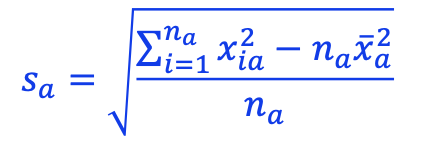

3. Se calcula la diferencia de medias: xa - xb
4. Se calcula la desviación estándar de la diferencia de medias

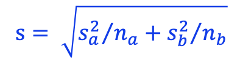

5. Se calculan los grados de libertad

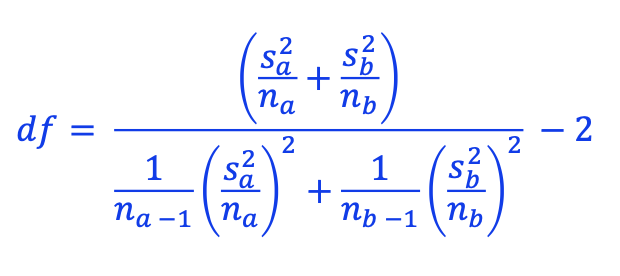

6. Por último, se calcula el intervalo de confianza para la diferencia de medias:

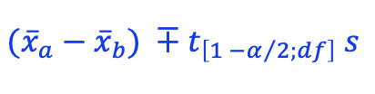

7. Si el intervalo de confianza incluye el 0, la diferencia no es significativa a un nivel de confianza del 100(1 - alpha)%.

## Pruebas de rendimiento (performance test)
### Introducción
Las pruebas de rendimiento permiten lo siguiente:
- Validar el ajuste del sistema a los RNF.
- Determinar la velocidad, escalabilidad y/o estabilidad de un sistema o aplicación.
- Obtener métricas de rendimiento bajo determinadas condiciones de carga.

Hay distintos tipos de pruebas:
- **Load Test**: Evaluación del comportamiento en situaciones de carga habitual y picos de carga.
- **Stress Test**: Evaluación del comportamiento en situaciones de carga extremadamente
elevadas.
- **Capacity Test**: Cuántos usuarios y/o transacciones puede soportar el sistema sin comprometer los objetivos de rendimiento.

#### **Conceptos básicos**
- Técnicas de medida: Para el sistema en actividad normal, la monitorización. Un sistema de pruebas controlado, mediante Benchmarking y/o pruebas de rendimiento.

- Benchmarking: Comparación del rendimiento de un sistema frente a unos valores de referencia.

- Pruebas de carga: Emulación del comportamiento de usuarios. Recogen medidas de rendimiento en diferentes escenarios de carga.

- Entorno de prueba: Máquinas encargadas de ejecutar los usuarios virtuales(driver machines) y el sistema en evaluación (SUT).

### Diseño de la prueba

La especificación de la carga de trabajo se hace mediante lo siguientes parámetros:
- El número de usuarios virtuales.
- El volumen de transacciones a procesar por usuario.
- El nivel de concurrencia de los usuarios.
- El período de tiempo de procesamiento.

Su parametrización mediante:
- Intensidad de la carga (sesiones/hora, p.ej.).
- Composición de la carga.
- Características del usuario: Tiempo de pensar y umbral de abandono.

#### **Tipos de carga**
**Estacionaria**: Usuarios virtuales constantes durante todo el período de duración de la prueba. 

No es real porque no refleja la variabilidad de usuarios simultáneos en el sistema. 

Se suele usar en pruebas de carga.

**Creciente**: Permite localizar el límite de la capacidad del sistema y establecer las condiciones de funcionamiento libre de errores.

**Basada en escenarios**: Es el modelo más completo. Reproduce las condiciones de variabilidad en base a los patrones temporales de actividad identificados para el sistema.

**Artificial**: Carga diseñada para identificar cuellos de botella o problemas específicos de rendimiento. Diseñada para **aislar** problemas de rendimiento.

#### **Métricas de interés**
**Monitorización de la máquina cliente**: El funcionamiento del cliente influye en el resultado. Marca el uso de memoria y procesador.

**Monitorización del servidor (SUT)**: Permite ver el uso de todos sus recursos hardware. 

PARA NUESTRO CASO, EL INDICADOR DEL DISCO NO ES FIABLE PORQUE ESTAMOS TIRANDO PETICIONES CONTRA UNA MÁQUINA VIRTUAL.

**Actividad y demanda**: Marca todo lo siguiente.
- Número de usuarios activos.
- Para cada unidad de tiempo el no de peticiones y datos enviados. 
- Transacciones ejecutadas (throughput)
- Para cada unidad de tiempo el tiempo de respuesta de las transacción y de cada componente de la transacción.
- Para cada unidad de tiempo el no de respuestas y datos recibidos.
- Para cada unidad de tiempo el no y tipo de errores.

#### **Tiempo de procesamiento**
La confianza en las conclusiones obtenidas de los experimentos de medida depende del tamaño de la muestra. 

Hay que tener en cuenta que **la recogida de grandes cantidades de datos es costosa**, y si el grado de precisión y nivel de confianza ha sido establecido hay que determinar el número mínimo de muestras a recoger.

Fases: Inicial o de carga --> estacionaria --> de parada. Las medidas sólo se recogen durante la fase estacionaria (fase estacionaria no quiere decir carga estacionaria).

Las observaciones pueden no ser independientes:
- Competencia por recursos que no se pueden compartir.
- Influye en el cálculo del intervalo de confianza: En estos casos, la varianza de la media puede ser varias veces mayor que la obtenida para observaciones pendientes.
- Método de réplicas independientes para el cálculo de la varianza de la media de observaciones correladas.

#### **Tamaño de la muestra**
Estimación del valor de una métrica de rendimiento:
- Precisión = +-r%
- Nivel de confianza = 100(1-alpha)

Cálculo del tamaño de la muestra:
- Para una muestra de tamaño n el intervalo de confianza viene dado por:

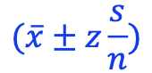

- Si se desea una precisión del r%, el intervalo de confianza ha de ser:

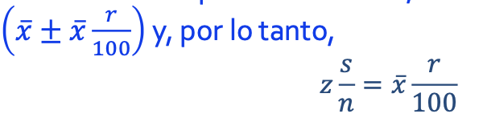

- De donde se obtiene que el tamaño de la muestra para ese nivel de precisión ha de ser:

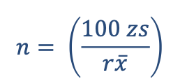

Siendo z el valor de la normal a nivel de confianza deseado: z1-alpha/2

#### **Estimación de la varianza de la media. Réplicas independientes**
1. Ejecutar *m réplicas* de tamaño *n* cada una.
2. Calcular la media para cada réplica:

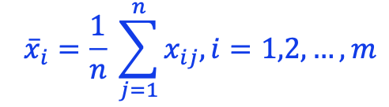

3. Calcular la media global para todas las réplicas:

4. Calcula la varianza de la media de las réplicas:

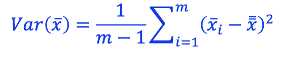

5. Calcular intervalo de confianza para la media

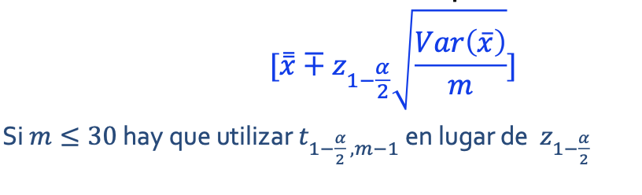

Observaciones:
- La anchura del intervalo de confianza es inversamente proporcional a (mn)^(1/2).
- Jain recomienda mantener un número de réplicas m <= 10 e incrementar el tamaño de n para alcanzar el nivel de confianza deseado.

### Depuración de resultados
Periodo inicial de carga: hasta que se alcanza el periodo estacionario. No se tendrán en cuenta en el análisis y elaboración de los índices de rendimiento.

Métodos para evitar que el periodo transitorio influya en los resultados finales:
- Las ejecuciones muy largas no son recomendables para nosotros.
- El arranque del sistema en estado estacionario no es posible en nuestro caso.
- Truncamiento: Supone que la variabilidad en el estado estacionario es menor que el periodo transitorio de estabilizacion.
- Borrado de datos iniciales.
- Media móvil: Cálculo de la media sobre intervalos de tiempo (series temporales).

#### **Truncamiento**
Dada una muestra de n observaciones: x1, x2,...,xn.
- Se ignoran las primeras l observacionnes y se calcula el mínimo y el máximo de las n - l observaciones restantes.
- Repetir el proceso para l = 1, 2, ... hasta encontrar la (l+1) observación que no sea ni el mínimo ni el máximo.

Este método puede dar resultados incorrectos.

#### **Borrado de datos iniciales**
Supongamos que disponemos de m réplicas de tamaño n:
- xij denota la j-esima observación de la i-esima réplica (i desde 1 hasta m, y j desde 1 hasta n).

Método:
1. Obtener una trayectoria media promediando sobre réplicas:

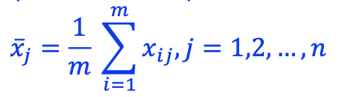

2. Calcular la media global:

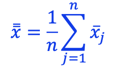

3. Inicializar l=1.

4. Eliminar las 𝑙 primeras observaciones y obtener la media global para las 𝑛 − 𝑙 observaciones restantes:

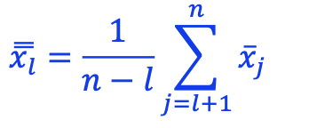

5. Calcular el cambio relativo:

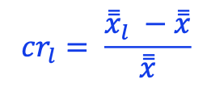

6. Repetir los pasos 4 y 5 variando l desde 1 hasta n-1.

#### **Media móvil**

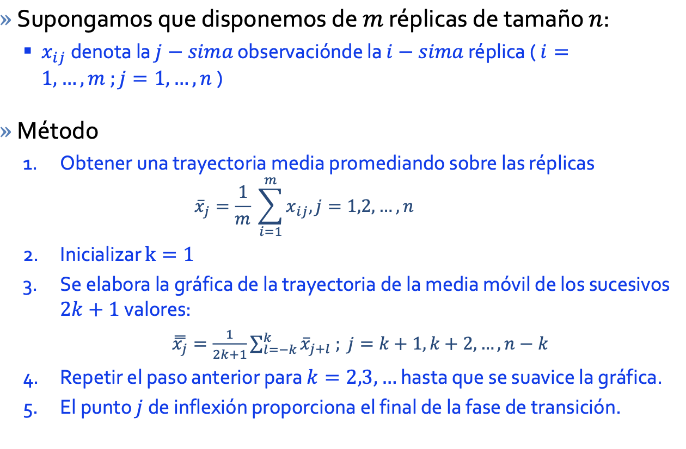

#### **Depuración y tratamiento de las observaciones**

Depuración datos fase de parada:
- Métodos similares a los usados para el periodo inicial o de carga.
- Tampoco incluir aquellos trabajos que no hayan finalizado.

Medidas por intervalos de tiempo:
- Sintetizar las medidas en intervalos de tiempo.
- Recoger: mínimo, máximo, media y total.

Evaluación de los resultados:
- Analizar el comportamiento del servidor en función del nivel de carga.