# Tema 2: Modelado Analítico

## Introducción
### Objetivo
Realizar una estimación cuantitativa del rendimiento en tiempo de diseño.
- Diseño de un nuevo sistema (hardware y/o software).
- Planificación de la capacidad y ajuste de sistemas.

### Técnica
Construcción, parametrización y evaluación de un modelo matemático del sistema observado.

### Modelo matemático de un sistema informático
*Construcción teórica que permitirá la representación del sistema en evaluación y que podrá ser utilizado para predecir, operar y controlar su comportamiento en diferentes escenarios*.

**Variables**
- Estado: Determinan en qué situación se encuentra el sistema.
- Entrada: Permiten modificar la evolución del sistema.
- Salida: Describen la respuesta del sistema.

**Parámetros**: Valores que permites establecer las relaciones entre variables.

**Relaciones funcionales**: Ecuaciones o inecuaciones que determinan el comportamiento y evolución del sistema.

### Teoría de colas
Estudia el comportamiento de los sistemas que se caracterizan por:
- Llegada (aleatoria) de solicitudes de servicio a un sistema.
- Las solicitudes son atendidas en funci ́on de un mecanismo establecido.
- Las que no pueden ser atendidas de inmediato quedan a la espera de recibir el servicio formando una l ́ınea de espera o cola.
## Modelado de redes de colas
### Centro de servicio
Conjunto compuesto por servidor(es) y cola de espera.

Tipos:
- Servidor único y una cola de espera.
- Varios servidores y una cola de espera.
- Infinitos servidores sin cola de espera.
    - Los trabajos siempre encuentran un servidor disponible.
    - Se denominan: Centro de retardo o demora.

### Red de colas
Una red de colas (**QN**) es una colección de *K* centros de servicio conectados que proporcionan servicio a un conjunto de clientes.

**Red abierta**: Llegadas y salidas externas. El número de trabajos varía con el tiempo.

**Red cerrada**: Número fijo de trabajos en el sistema.

La diferencia entre ambas es la constancia de los trabajos en el sistema. No es lo mismo tener una tasa de llegadas constante que tener un número de trabajos constante en el sistema.

El nivel de **concurrencia** en ambas redes es distinto (en las **redes abiertas no tiene por qué ser constante**, mientras que en **redes cerradas sí que lo es**).

**Modelo de servidor central**
- Patrón de conexión entre los centros de servicio.
- Las entradas y salidas al sistema son hacia y desde el servidor central.
- Los flujos de trabajos en la red desde y hacia el servidor central.

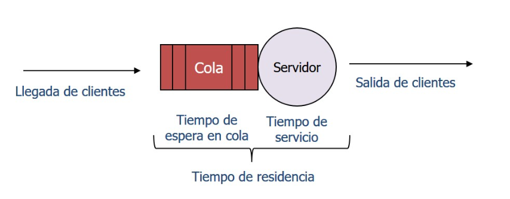

**Variables del modelo de servidor central**
- \[A]: Llegadas.
- \[V]: Visitas.
- \[C]: Finalizaciones.
- Lambda: Tasa media de llegadas (tiempo de llegada es 1/lambda).
- W: Tiempo de espera en cola.
- S: Tiempo de servicio.
- R: Tiempo de residencia (= W + S).
- X: Productividad o Throughput.

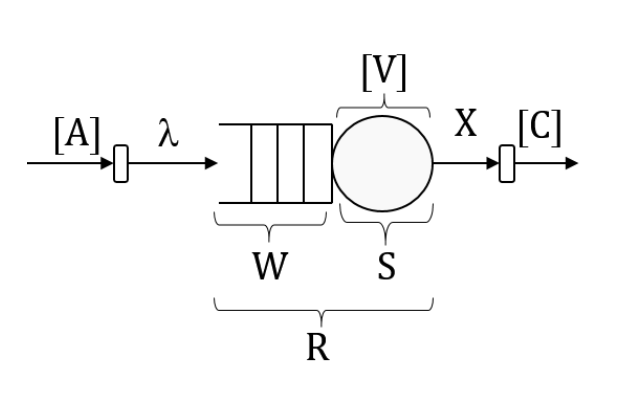

**Tipos de centro de servicio**
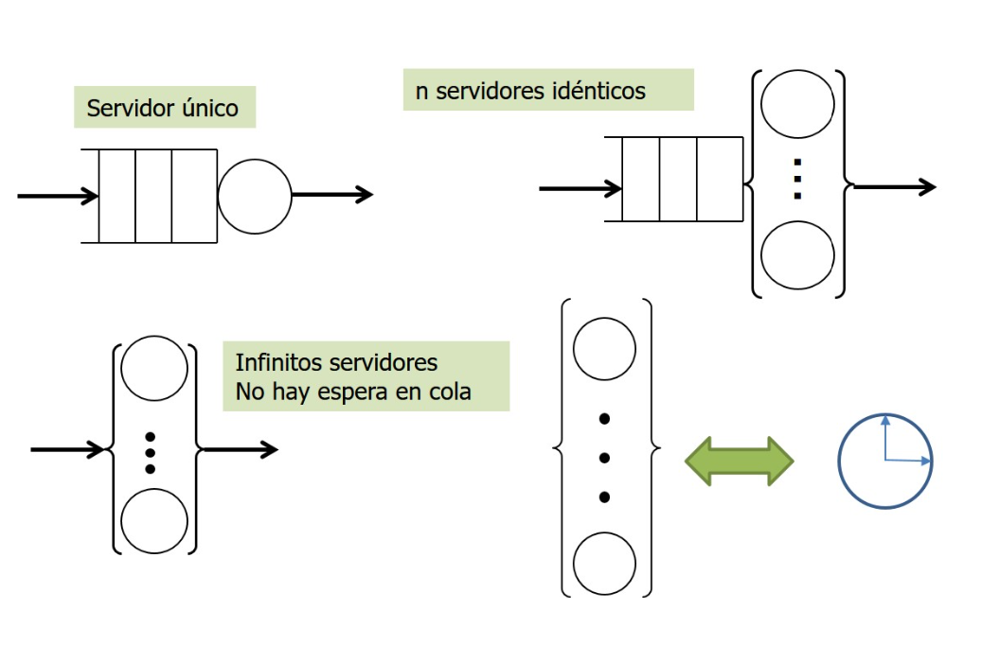
Para nosotros el más común será el de servidor único.

**Tipos de red de colas**
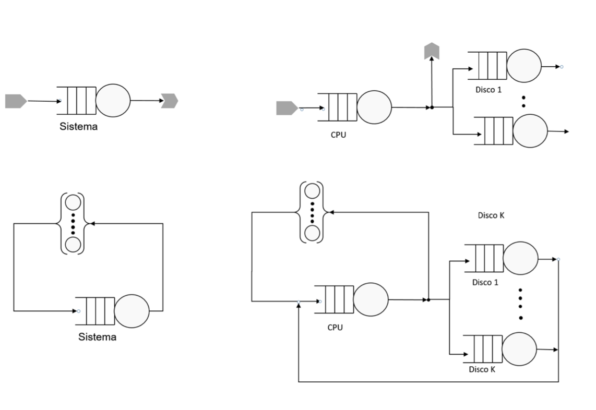

### Modelo de redes de colas
Debemos describir 2 categorías en los parámetros del modelo.
1. Descripción de los centros de servicio
    - Tiempo de servicio.
    - Número de servidores.
    - Capacidad (Número máximo de clientes en el centro de servicio): Trabajaremos con capacidad infinita.
    - Disciplina de servicio: FCFS (First Come Firt Serve)
2. Descripción de los clientes (carga de trabajo a procesar)
    - Intensidad. Tasa a la que llegan los clientes al sistema.
    - Demanda de servicio. Tiempo total de servicio proporcionado por un recurso a una determinada clase de trabajos (Media).

#### Modelado analítico
Objetivo: Representar el comportamiento de los componentes del sistema y de la carga a procesar.

**Sistema**: Determinado por el nivel de abstracción al que se representa el sistema y los aspectos a considerar (Sistema de computación, de información, ...).

**Clientes**: Los trabajos (transacciones, jobs, interacciones, ...) a procesar por el sistema.

**Servicio**: El proporcionado por los diferentes subsistemas (memoria, procesador, ES, ...).

**Cola**: Abstracción de un buffer.

#### Representación gráfica de las conexiones entre dispositivos
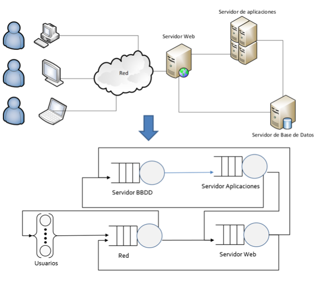

#### Sistemas de computación
**Centros de servicio**: Conjunto de subsistemas individuales conectados que representan recursos del sistema.

Tipos de recurso por tasa de servicio:
- Intependientes de la carga.
- Dependientes de la carga.
- Centro de demora.

Disciplina del proceso de servicio: **FCFS**, Cola con prioridad, Round Robin, ...

**Modelado de la carga. Clientes**: Trabajos a ser ejecutados por el sistema. Compiten por los recursos del mismo.

Intensidad de carga:
- Transacciones. Clase abierta.
    - Tasa de llegadas.
- Batch y terminales. Clase cerrada.
    - Batch. El número de peticiones concurrentes que están en ejecución.
    - Interactiva. Número de terminales o máquinas clientes y por el tiempo medio de pensar.

Demanda de servicio.

Clases de clientes: Una clase de trabajos, Múltiples clases de trabajos (se simplifica con la media).
## Análisis de colas
**Análisis operacional**: La elaboración y resolución del modelo se lleva a cabo usando variables operacionales, variables medidas en un intervalo de observación.
- Proporciona una visión de alto nivel del comportamiento, en términos de valores medios, del sistema.
- Hipótesis que pueden verificarse mediante medidas directas (operacionales).

**Análisis estocástico**
La elaboración y resolución del modelo se lleva a cabo teniendo en cuenta que los tiempos entre llegadas de los trabajos y los tiempos de servicio se ajustan a ciertas distribuciones de probabilidad.
- Permite proprocionar respuestas más detalladas
- El comportamiento del sistema se específica en función de la distribución del número de trabajos en el sistema en el instante de tiempo t.

### Condiciones
- Balance de flujo de trabajos: Para un período de observación suficientemente grande el número de trabajos que llegan a un sistema ha de ser igual al número de trabajos que salen.
- One-step behavior: Ni movimientos simultáneos de trabajos entre servidores, ni entradas y/o salidas simultáneas al sistema.
- Homogeneidad: La tasa media de llegadas al sistema y la tasa media de salidas del sistema son independientes del estado del sistema. El enrutamiento de los trabajos es independiente del estado del sistema.
- Exclusividad: Un trabajo no puede estar en dos o más dispositivos al mismo tiempo. Cuándo un trabajo está recibiendo servicio, tiene uso exclusivo del servidor.
- No bloqueo: Los dispositivos no pueden ser bloqueados por otros.
- Independencia: Los trabajos no puede interaccionar de ninguna forma. No se permite la sincronización de trabajos.

### Consideraciones 
Una red de colas es *separable* o *product-form* si cumple las condiciones anteriores y además cumple la condición de balance de flujo de trabajo para cada centro de servicio.
- Facilita la resolución de las redes de colas.
- Se puede evaluar la solución para cada centro de servicio de forma aislada.

**Centros independientes de la carga o fixed-capacity service centers**: La tasa de finalizaciones independiente de la longitud de la cola (homogeneidad).

**Centros dependientes de la carga**: La tasa de finalizaciones dependiente de la longitud de la cola (homogeneidad débil).

###  Modelo de red de colas
Variables operacionales: Variables cuyos valores se pueden obtener mediante medida directa del sistema durante un intervalo de observación finito.
- T (segundos). Es el tiempo, intervalo de observación o medida del sistema.
- K. Número de recursos (centros de servicio) en el sistema.
- A. Número de llegadas de peticiones al sistema en el tiempo T.
- Ak. Número de solicitudes de servicio al recurso *k* en el tiempo T.
- C. Número de peticiones completadas por el sistema en el tiempo T.
- Ck. Número de finalizaciones de servicio en el recurso *k* en el de tiempo T.
- Vk. Número de visitas al servidor k en el intervale de tiempo T.
- Bk. Tiempo en el que el recurso k ha estado ocupado durante el tiempo T.

#### Intensidad de carga
**Tasa de llegadas**: Mide las llegadas al sistema de los clientes o peticiones por unidad de tiempo.

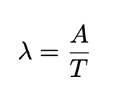

**Balance de flujo de trabajo**: Bajo la hipótesis del equilibrio de flujo, y para un T suficientemente grande se verifica que A es casi igual a C. Dividiendo ambos valores por el valor del período de medida T, se obtiene,

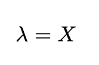

**Notas**
- Un sistema está en estado estacionario si Lambda = X.
- Intervalo entre llegadas: 1/Lambda.

#### Medidas básicas de rendimiento
**Productividad**: Mide la cantidad de trabajo realizado por un elemento por unidad de tiempo.
- Productividad del sistema, throughput, X.

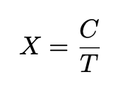

- Productividad de cada centro de servicio, throughput local, Xk.

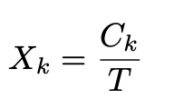

- Productividad relativa. Relación de proporcionalidad que se da entre las finalizaciones globales y locales cuando el sistema está en estado estacionario.

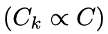

**Ley de flujo forzado**
- Ratio de visitas Vk: Constante de proporcionalidad que indica la relación entre el número de operaciones locales y globales ejecutadas durante el periodo de observación T.

Partiendo del concepto de productividad relativa y de la definición de ratio de visitas Vk, se puede expresar la relación anterior cómo *Ck = VkC*, y dividiendo ambos términos por T se obtiene,

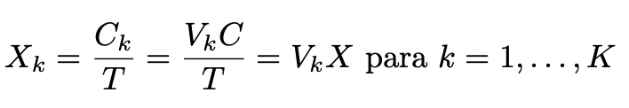

- Ley del flujo forzado. Xk = VkX. Establece la relación entre la productividad del sistema y la de cada uno de sus dispositivos.

- Tiempo de servicio. Es el tiempo medio necesario para dar servicio a una petición en el centro de servicio k. Tiempo medio durante el que un cliente ocupa el servidor.

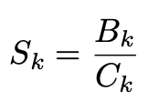

- Tasa de servicio. Es la inversa del tiempo de servicio.

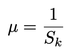

- Demanda de servicio. Cantidad de servicio que cada petición a nivel de sistema requiere de cada uno de sus recursos.

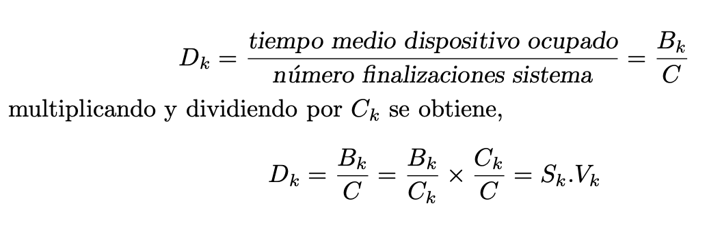

- Utilización. Es la proporción del tiempo de ocupación del servidor en relación al periodo de observación T, y su expresión es:

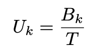

    - Notación. En teoría de colas lo habitual es denotar la utilización por *p*.
    - Observación. Teniendo en cuenta que Bk <= T se tendrá que 0 <= Uk <= 1.

**Ley de la utilización**: La utilización de un recurso es igual al producto del *throughput* por el tiempo medio de servicio *Uk = XkSk*.

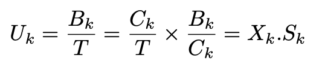

- Relaciones en utilización:

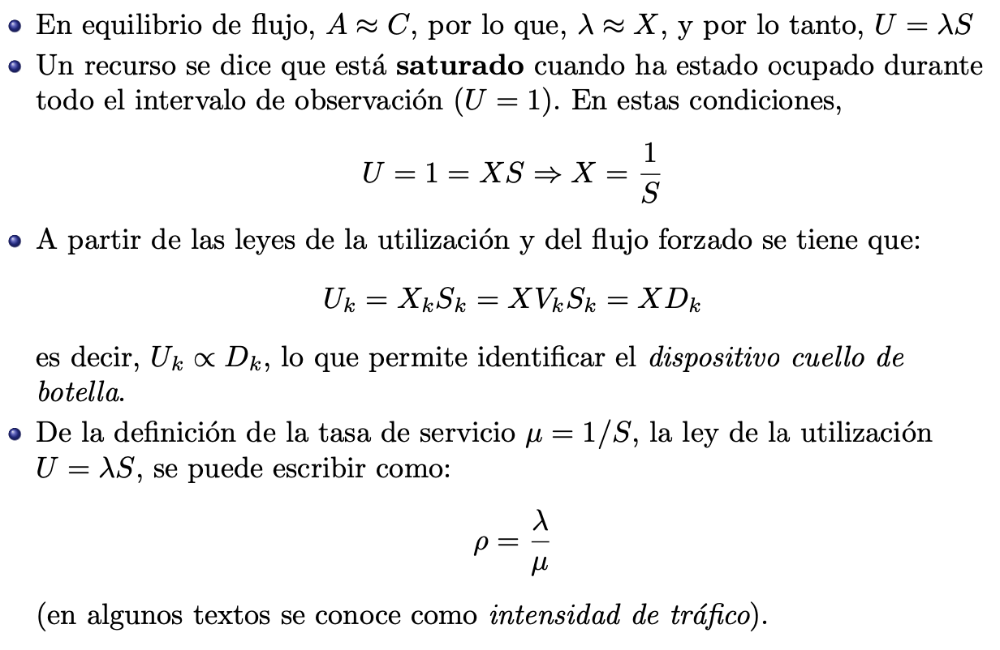

- Tiempo de residencia. Es el tiempo medio que una petición consume en el centro de servicio. Es la suma del tiempo medio de espera en la cola Wk con el tiempo medio de servicio Sk

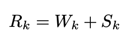

- Tiempo de respuesta. El tiempo medio de respuesta es la suma de los tiempos medios de residencia en cada uno de los centros k de la red de colas.

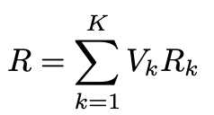

**Nota**. En esta definición Rk es el tiempo consumido en una visita. El modelo está parametrizado en términos de Vk
 y Sk.

##### **Ley de Little**
La longitud media de la cola *Q* es igual a la tasa de llegadas media *Lamba* por el tiempo consumido en el centro cola, el tiempo medio de residencia *R*.

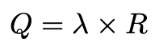

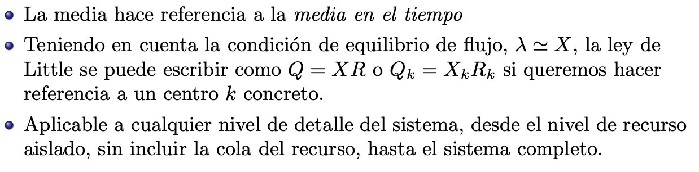

**Niveles del sistema**
- Nivel 1. Recurso sencillo sin incluir cola.
  - Población. Trabajos presentes en el servidor (Una petición el Uk(%) del tiempo y cero peticiones el 1 - Uk(%) del tiempo). *Q es equivalente a U*.
  - Tasa de llegadas. Tasa con la que el recurso satisface las peticiones (Xk).
  - Tiempo medio de servicio para las peticiones en el recurso. *Rk equivalente a Sk*.
  - Ley de Little. Uk equilavente a XkSk = *Lambda*S. Se obtiene la ley de la utilización como un caso particular de la Ley de Little.
- Nivel 2. Centro de servicio.
  - Población. Trabajos presentes en la cola y en el servidor.
  - Tasa de llegadas. Tasa con la que llegan las peticiones al recurso (*Lamba*k).
  - Tiempo de residencia. Tiempo medio que la petición consume por cada visita al recurso (incluye el tiempo en cola y en servicio). *Rk= Wk + Sk*.
  - Ley de Little. *Q = Lambda(W+S) = LambdaW + U*.
- Nivel 3. Subsistema central, sin los terminales.
  - Población. Clientes presentes en el subsistema central, aquellos usuarios que no están pensando.
  - Tasa de llegadas. Tasa de interacciones entre el subsistema central y los terminales.
  - Tiempo de residencia. La definición habitual de tiempo de respuesta.
  - Ley de Little. *Q = LambdaR*
  
##### **Análisis de Rendimiento**
**Elementos para la evaluación del modelo**

Variables operacionales: Valores medios de cantidades que se pueden medir directamente.

Leyes operacionales: Relaciones entre variables operacionales. Permiten la caracterización del comportamiento del sistema.

Estimación del rendimiento del sistema.
- Soportado por las medias de valores observados: Buena aproximación. El grado de simplificación es bastante notable.
- Soportado por procesos aleatorios o estocásticos. Modelado más preciso del comportamiento.

**Configuraciones**

Centros:
- Un centro de Servicio.
  - Servidor único. Análisis a nivel de sistema o a nivel de componente aislado.
  - Multiservidor. Análisis de sistemas multiprocesador, p.ej.
- Red de colas. Múltiples centros de servicio. Análisis detallado del rendimiento, incorpora las interacciones entre los elementos.
  
Número de clientes: No limitado (**Cola abierta**) vs limitado (**Cola cerrada**).

Caracterización de la carga: Una clase de clientes vs múltiples clases de clientes.

## Un centro de servicio. Servidor único
### Cola Abierta
#### Condiciones
- Número limitado de clientes.
- Condición de estabilidad (se evitan colas infinitas): 
  
  
- Tasa de llegadas de transacciones independiente de la carga del sistema.
- Distribuciones exponenciales
  - Tiempo entre llegadas: El tiempo que transcurre hasta la próxima llegada es independiente del instante en el que se produjo la última.
  - Tiempos de servicio: El tiempo residual que le queda a un cliente para finalizar su servicio es independiente del tiempo que ya lleva en servicio.
- Centro de servicio independiente de carga.
- Una clase de clientes.

<!--imagen centrada-->

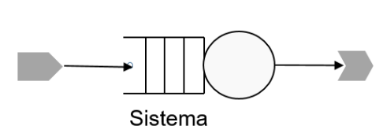

Tiempo de residencia en cola: *R = S(Q+1)*
- Longitud media de la cola Q. La espera estimada será de QS segundos.
- Tiempo medio de servicio S. La espera estimada será de S segundos.

Aplicando la Ley de Little, *Q = Lambda * R*, a la expresión anterior tenemos

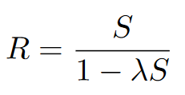

y por la ley de la utilización *U = Lambda * S*, se tiene

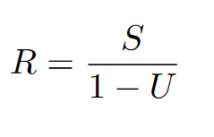

Partiendo de la expresión del tiempo de residencia, multiplicando por *Lambda* ambos lados de la ecuación, se obtiene:

  
  

El tiempo de espera en cola estimado viene dado por *Q * S*,

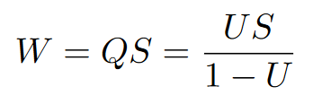

lo que permitirá calcular el número medio de trabajos esperando en cola,

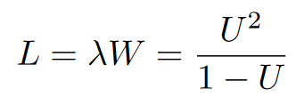

### Cola cerrada
### Condiciones
- Número limitado de clientes fijo y finito (N).
- Clientes en una de dos situaciones
  - Estado tiempo de pensar (Z): Esperando a incorporarse a la cola.
  - En el centro de servicio.
- Centro de servicio independiente de carga.
- Distribución exponencial para los tiempos de servicio.
- Una clase de clientes.
  
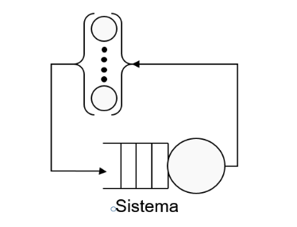

El tiempo de respuesta R y la productividad X dependen del número de clientes N (Efecto retroalimentación)
- A medida que el centro está más ocupado, la tasa a que se va ocupando se reduce.
- Si los N clientes están en el sistema, no hay nuevas llegadas.

**Ley de tiempo de respuesta interactivo**: Cada usuario, por término medio, *T/(R+Z)* peticiones en el intervalo de tiempo T

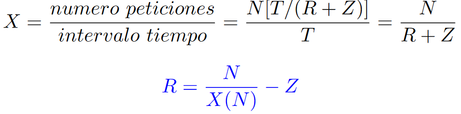

## Modelos de redes de colas. Una clase de trabajos

