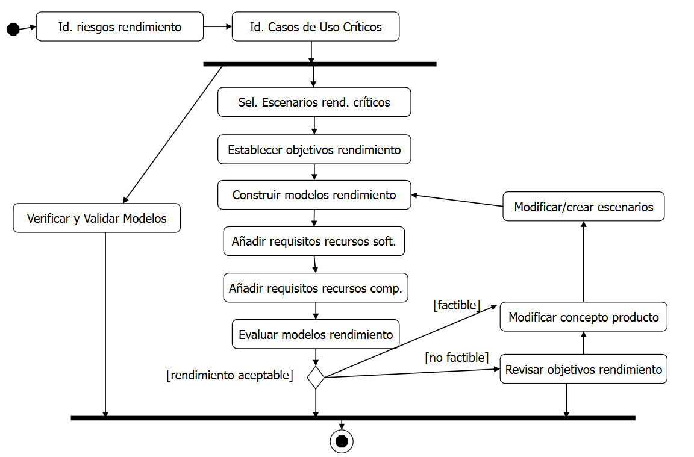
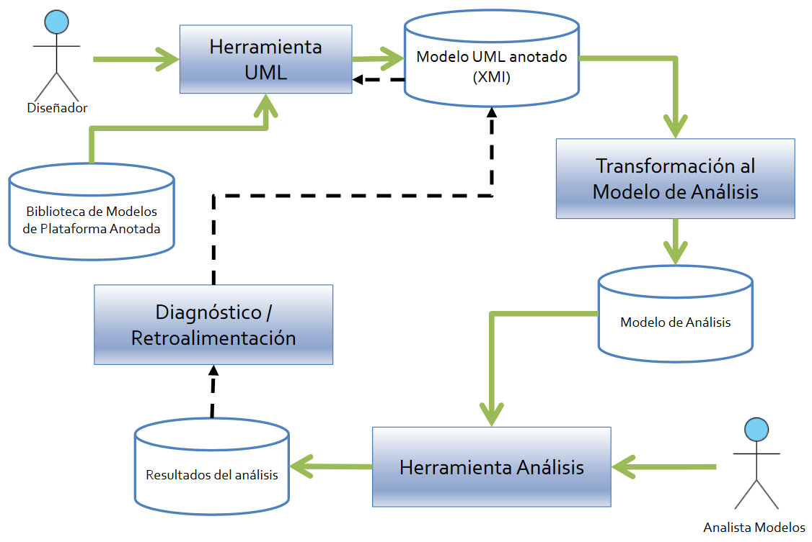

# Tema 3: Ingeniería del Rendimiento en el Desarrollo de Software

## Aspectos de la Ingeniería del Rendimiento en el desarrollo de software
### Actividades de la Ingeniería del Rendimiento Software

- Ingeniería del Rendimiento Software:
  - Proceso soportado por modelos:
    - Predicciones de evaluación.
    - Control de requisitos.
    - Seguimiento de estimación.
  - Fases:
    - Contrucción del modelo.
    - Evaluación del modelo.
  - Categorías:
    - Software Model.
    - Machinery Model.
  
Dentro del diseño del rendimiento Software, tenemos que realizar las siguientes tareas:
- Identificar transacciones y operaciones críticas del sistema.
- Elaborar tanto planes iniciales de planificación de capacidad, como planes y estrategias de pruebas de rendimiento.
- Evaluación del rendimiento. Tiene impacto en:
  - Las decisiones arquitectónicas y de diseño en el rendimiento final del sistema.
  - En el rendimiento del sistema de software de terceros.

Además, en el análisis del rendimiento tenemos 2 grupos grandes de tareas:
- Análisis de escenarios.
- Análisis del sistema.
### Métodos de la Ingeniería del Rendimiento Software
Se incorporan actividades de modelado, análisis y evaluación del rendimiento en las distintas flases del ciclo de vida(p.ej, proceso unificado).

#### Ingeniería del rendimiento software según Smith
Se lleva a cabo mediante un enfoque cuantitativo y sistemático para construir sistemas software que se ajusten a los requisitos de rendimiento, estando además enfocado en la arquitectura, el diseño y la implementación.

El modelo de ejecución del Software:
- Representa los aspectos fundamentales del comportamiento estimado de la ejecución del software en desarrollo.
- Proporciona parámetros de la carga de trabajo.
  
El modelo de ejecución del sistema cuantifica los efectos de la contención en los recursos del sistema en función de los diferentes tipos de carga real.

Las estrategias de modelado que propone son:
- **Simple-Model**:
  - Identificación rápida de problemas de rendimiento con la arquitectura, el diseño o los planes de implementación elegidos.
  - Contrucción de modelos sencillos.
- **Mejor y peor caso**:
  - Establecimiento de los límites iniciales del rendimiento esperado.
  - Caso más favorable y caso más desfavorable.
- **Adapt-to-precision**:
  - Incremento de la precisión y detalles de los modelos a medida que se avanza el conocimiento del sistema software a construir.

Integración de estas ideas en el desarrollo de Software:
- Centrado en casos de uso y escenarios.
- SPE & UML: Extensiones de UML, especificación de tiempo en Diagrams de secuencia y elementos de concurrencia.

### Requisitos de rendimiento.
Un requisito de rendimiento especifica características temporales del sistema, tales como la tasa a la que el sistema procesa unidades de trabajo o cuánto tiempo se consume en manejar o procesar una unidad de trabajo.

Estas características se basan en métricas: Métricas informativas respecto al dominio, que son medibles y están expresadas en una escala de tiempo concreta.

**Acrónimo SMART**:
- **S**pecific (específo): Evitar términos cualitativos del tipo alto, poco, bajo, etc...
- **M**easurable (medible).
- **A**cceptable (aceptable).
- **R**ealizable (realizables): Los requisitos deben ser viables.
- **T**horough (completo): Han de contemplarse todas las posibilidades.

Lo requisitos de rendimiento suelen ser peticiones como si fuera un documento de intenciones por parte del cliente. Hay que tener en cuenta que cuándo se da preferencia a un tipo de requisito no funcional, se suele perjudicar otro, ya que es imposible satisfacer todo de forma equilibrada (p.ej, preferencia al rendimiento frente a la seguridad).

Tipos de requisitos de rendimiento referentes a: escalabilidad, disponibilidad, productividad, respuesta. Deben ser específicos y claros para poder llevarlos a cabo de forma satisfactoria, aunque cómo ya se ha mencionado, se suelen especificar más como intenciones o deseos que cómo algo que debe cumplirse de una forma determinada.

Definición de **sostenibilidad**: Un mix de transacciones que es procesado con un ratio determinado (tps) es sostenible si se cumplen todas las condiciones siguientes:
- Se cumplen los requisitos de tiempo medio de respuesta.
- Se cumple el requisito de que la probabilidad de que el tiempo de respuesta exceda un determinado nivel se mantenga por debajo del límite establecido.
- Un pequeño incremento (cuantificado) en la tasa de transacciones solamente provocará un pequeño incremento (cuantificado) en el tiempo medio de respuesta.
- La utilización media de todos los recursos del sistema y del ancho de banda se mantienen por debajo de un umbral (cuantificado) establecido.
- No hay fallos de memoria.

Definición de **escalabilidad**:

Condiciones:
- Dimensión temporal -> sostenibilidad.
- Dimensión espacial -> alojamiento en memoria y en disco.

Un sistema puede dar soporte a n-usuarios si se cumplen todas las condiciones siguientes:
- La carga combinada (mix de transacciones) que generan esos n-usuarios es sostenible.
-  Los espacios concurrentes de trabajo (concurrentfootprint) se alojan en memoria sin provocar demasiada paginación (cuantificada -límites), que dé como resultado una carga no sostenible.
-  Hay espacio suficiente para albergar la combinación de todas sus áreas de trabajo en disco.

## Modelado del rendimiento de sistemas software
### Análisis de rendimiento basado en modelos
Modelado de los sistemas software y la predicción de su rendimiento bajo cierta carga.
- Contrucción, generación del modelo. Modelos de diseño del sistema y modelos software.
- Evaluación del modelo. Modelos de rendimiento.

Evaluación de las propiedades NO FUNCIONALES. Incorporacion de anotaciones en el modelo de diseño y evaluación de las alternativas de diseño.

Anotación del modelo de diseño:
- Descripciones precisas de los requisitos y restricciones de rendimiento.
- Varios modelos de análisis (parámetros operacionales y de carga).

Tareas automatizables:
- Obtención del modelo de análisis
  - Transformación del modelo de diseño en el modelo específico de análisis.
  - Modelo intermedio de rendimiento.
- Resolución del modelo de análisis
  - Nivel escenario: Evalúa procesamiento para cada tipo de evento que gestiona un escenario.
  - Nivel sistema: Evaluación de eventos que se pueden gestionar por unidad de tiempo.
  
  

### Modelado del rendimiento con UML
#### Roles de los diagramas UML en el modelado del rendimiento
Modelos de casos de uso
- Actores: Elemento base para la definición de la carga del sistema.
- Casos de uso: Funcionalidad crítica, obtención de datos de rendimiento por escenario.

Diagramas de interacción
- Diagramas de secuencia:
  - Soporte modelado y análisis de rendimiento.
  - No escalan bien para sistemas complejos.
- Diagramas de actividad:
  - Modelado de la carga de trabajo de los procesos.
  - Mejores que los de secuencia para mostrar concurrencia.
  - Escalan mejor en sistemas complejos.

Diagramas de implementación
- Diagrama de despliegue:
  - Modelo de recursos. Capacidades y rendimiento.
  - Soporte para construir el modelo analítico, modelo de colas.
#### Mecanismos de anotación básicos
Estereotipos
- Extienden el vocabulario de UML permitiendo crear nuevos tipos de bloques de construcción que deriven de los existentes y específicos a un problema. 
- Especialización de una entidad UML que implica una determinada interpretación.
 
Valores etiquetados
- Extiende las propiedades de un bloque de construcción de UML, permitiendo añadir nueva información en la especificación de ese elemento.
- Desde UML2 solamente puede ser representado como un atributo definido en un estereotipo.
- Sus valores se aplican a la especificación del elemento no de sus instancias.
  
Restricciones
- Extiende las reglas semánticas de un bloque, permitiendo añadir nuevas reglas o modificar las existentes.
- Cadena de texto entre llaves que especifica una cierta condición o regla sobre el elemento de modelado que se debe mantener como cierta.

Propiedades no funcionales.

UML estándar
- No proporciona capacidades para el modelado de los NFP.
- Sintaxis para la expresión de los valores muy limitada: Ni variables, ni valores estructurados, ni expresiones de tiempo complejas, ...
  
NFP de rendimiento
- Describen las características del comportamiento del sistema.
- La especificación ha de incorporar
  - Aspectos cuantitativos: 3
  - La unidad en la que está medida: 3 segundos.
  - Aspectos cualitativos: periodicidad, fuente, parámetros estadísticos, etc
    - .. el máximo para (requerido) ... será de 3 segundos.
#### Restricciones de tiempo en UML2
Time observation: Referencia a un instante de tiempo durante una ejecución.

Time constraint: Especifica el momento (tiempo) en el que se produce un evento o un periodo de tiempo entre eventos. Notación de restricción (entre llaves) y conectado al elemento.

Duración: Especificación del tiempo transcurrido entre dos eventos.

Intervalo: Rango de valores entre dos valores establecidos. Expresión del tipo *límite inferior...límite superior*.

Time mark: Asigna una restricción de tiempo a un evento. Representado por una pequeña línea horizontal en el diagrama.
#### Perfiles

### OMG UML - MARTE
### Anotaciones de Rendimiento con MARTE - PAM
