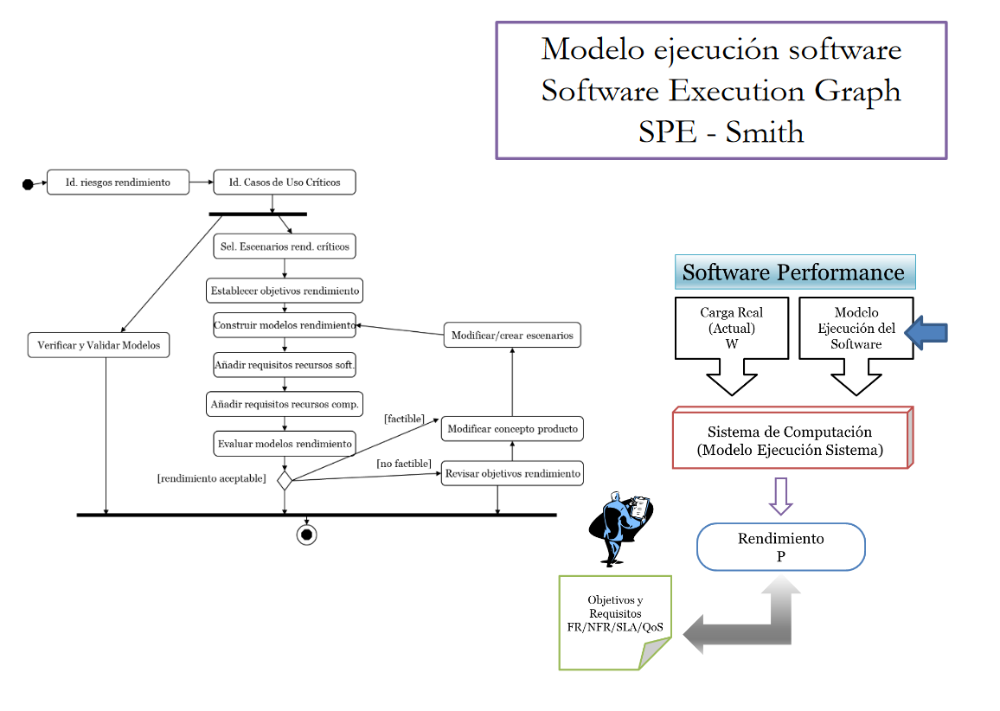
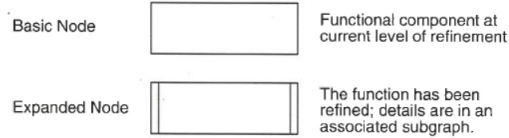
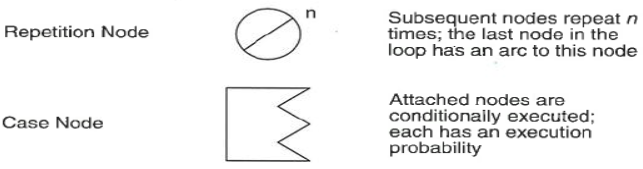
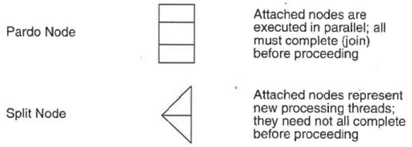
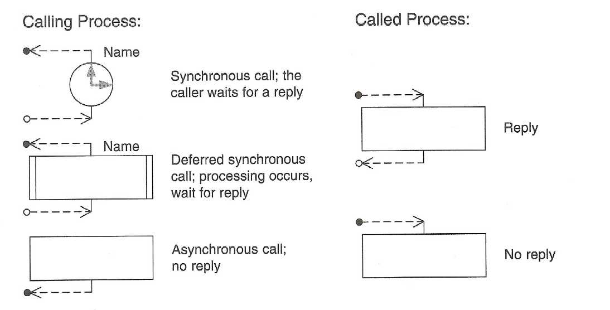
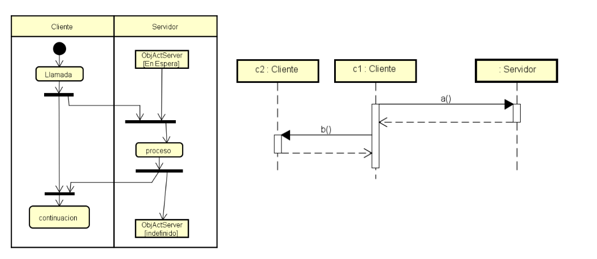
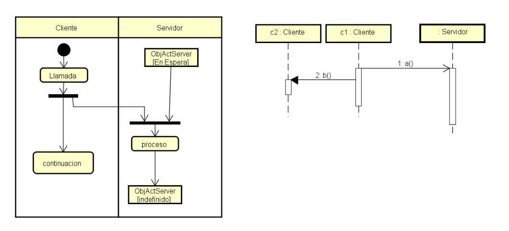
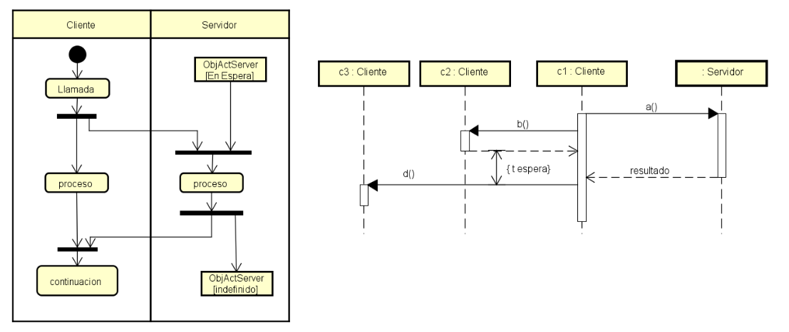
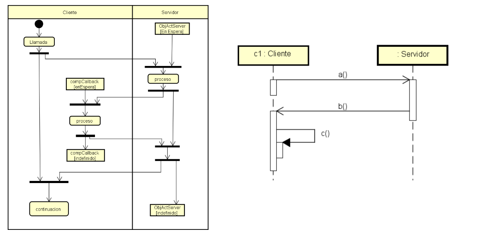

# Tema 4: Modelo de ejecución del Software / Sistema

## Modelo de Ejecución del Software

### Modelos de Ejecución del software
Software Model:
- Captura los aspectos esenciales del comportamiento del sofware.
- Se basa en los grafos de ejecución propuestos en SPE.
- Se obtiene a partir de los Casos de Uso y del Diagrama de Secuencia.

Nodos del Execution Graph:
- Componentes de carga software: Conjunto de instrucciones o procedimientos realizando una determinada tarea.
- Ponderados por un vector de demanda: representa la utilización de recursos por parte del nodo.

Cada nodo tiene asociado un vector ponderación indicando la demanda de cada recurso.
#### SPE - Modelo de ejecución Software
**Recorrido de los escenarios de uso**: Convertir el escenario en un Software Execution Graph (SEG).

**Modelo simple del sistema**: Análisis fundamentado en la utilización de recursos (CPU, discos, ...).

**Pseudo-operaciones**: Operaciones virtuales que encapsulan un bloque de construcción de procesamiento utilizado en el sistema.

**Tiempo de servicio de los recursos**.

**Cálculo de la demanda de servicio**: Cuantificar los recursos en términos del tiempos y las pseudo-operaciones en términos de utilización de los recursos (estimaciones groseras).

**Caracterización de los nodos básicos**.

**Cálculo final del escenario**.

#### Modelo de ejecución software SPE
**Modelo** simple del rendimiento de la nueva (versión) aplicación.
- Su evaluación permite estimar la carga de la nueva aplicación en desarrollo.
- Grafo obtenido a partir del diseño y/o estructura de la nueva aplicación (Escenarios, casos de uso, ...).
  
Grafo de ejecución software (EG)
- Formalismo que facilita la representación de comportamientos complejos del software.
- Soporte para realizar la evaluación del rendimiento.
- Nodos: componentes de carga de software.
- Arcos: transferencias de control.

Diagramas de actividad (UML2)
- Permiten describir el flujo de control global de un sistema.
- Alternativa a los EG.
  
##### Grafos de ejecución (SPE)
Se crea un grafo de ejecución a partir de la estructura de ejecución de cada escenario de rendimiento (carga de trabajo).
- Nodos: Pasos de procesamiento.
  - Colección de invocaciones de operación.
  - Sentencias de programas que realizan una función.
- Arcos: Representan el orden de ejecución.
- Restricciones
  - Los grafos y sub-grafos solamente pueden tener un nodo inicial.
  - Todos los bucles en el grafo tienen que ser repetición.

###### **Tipos de nodos**

- **Nodo básico**.
  - Pasos de processamiento al nivel de detalle más bajo posible para la fase de desarrollo actual.
  - Especificar los requisitos de recursos para cada nodo básico.
- **Nodo expansión**.
  - Pasos de procesamiento que se detallarán en otro grafo de ejecución (subgrafo).
  - Permite ir mostrando los detalles de procesamiento identificados a medida que progrese el diseño y se tenga más información.

- **Nodo repetición**.
  - Representa uno o más nodos que se repiten según el factor de repetición asociado al nodo.
  - El último nodo que se repite se conecta mediante un arco con el nodo repetición.
- **Nodo case**.
  - Ejecución condicional de los pasos de procesamiento.
  - Tiene uno o más nodos asociados.
  - Cada nodo asociado tiene un probabilidad de ejecución.
    - Suma de probabilidades de los nodos alternativos asociados = p.
    - Probabilidad de continuación de ejecución del nodo = 1 - p.

- **Nodo pardo**.
  - Ejecución en paralelo.
  - Todos los hilos han de finalizar antes de que el proceso continúe.
- **Split node**.
  - Ejecución en paralelo.
  - No se necesitan sincronizar una vez finalizados.

- **Otros nodos**.

###### **Cliente - Servidor y sistemas distribuidos**
**Arquitecturas multi-nivel (n-tier)**
- Introducen capas adicionales de actividad.
- Necesidades de procesamiento de los diferentes nodos de computación (niveles).
- Demoras de sincronización.
- Sobrecarga procesamiento debido al middleware (soporte distribución).

**Modelo de ejecución software**
- Recoge comunicación y sincronización entre los objetos.
- Nivel arquitectónico y de diseño.
- No se incluirán los detalles de la tecnología del middleware.
- Incorpora los retrasos en el cliente en la recepción de respuesta por parte del servidor.
  
Nodos diferenciados en el grafo de ejecución para el proceso que invoca y el proceso invocado.

###### **Tipos de interacción del sistema contemplados**
- **Comunicación síncrona**.
  - El procesamiento de una petición se inicia en el cliente.
  - El servidor procesa la petición y envía la respuesta.
  - El cliente recibe la respuesta y prosigue el procesamiento.
   

- **Comunicación asíncrona**.
  - El proceso cliente invoca una petición y sigue con su procesamiento.
  - El procesamiento en la red y el servidor prosigue, no hay respuesta.

- **Comunicación síncrona diferida**.
  - El proceso cliente invoca la petición y sigue con su procesamiento.
  - El procesamiento en la red y el servidor se comporta igual que el caso de la comunicación asíncrona.
  - El cliente en algún momento del proceso necesita el resultado antes de continuar.

- **Callback asíncrono**.
  - El cliente realiza una petición asíncrona al servidor y sigue con su procesamiento.
  - La petición incluye información suficiente para que el proceso del servidor invoque al proceso del cliente (callback) con otra llamada asíncrona cuando finalice la operación.
  - Este tipo de sincronización requiere dos procesos en el cliente uno para la llamada (call) y otro para la respuesta (callback).

###### **Contrucción del modelo de ejecución del software**
- Identificación de los procesos críticos de negocio. Evaluar los riesgos en rendimiento (CU críticos y transacciones críticas).
- Seleccionar los escenarios de rendimiento clave.
  - Para cada escenario principal de caso de uso seleccionado, elaborar el diagrama de secuencia.
  - Se pueden incorporar anotaciones temporales y de tamaño de información intercambiada.
- Elaborar un Grafo de Ejecución para cada escenario seleccionado. 
  - Trasladar cada diagrama de secuencia (diagrama de actividad) a un grafo de ejecución.
- Análisis del modelo de ejecución del software
  - Cálculo de los requisitos totales de procesamiento para cada recurso.
  - Estimación del mejor tiempo de respuesta (elapsed time).
  - Se excluyen los retrasos por espera en cola.

###### **Elaboración del diagrama de secuencia para cada caso de uso**